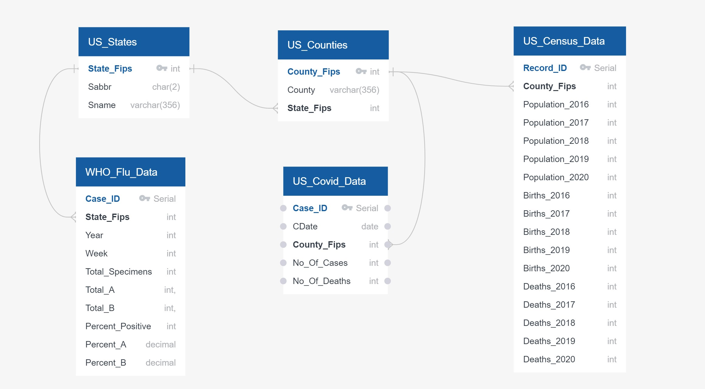

#### Project 2 - **Extract Transform Load**

<table><tr><td align="center"></tr></td></table>

## Project Description 
In 2020-2021, the most important global issue has been the COVID-19 pandemic. Health professionals and researchers around the world have been working hard to make available, the data related to cases, testing, and mortality. We are utilizing publically available Covid 19 data for our ETL project. 

**At the end of ETL process, the prepared data would have answered these questions and more:**
 * "Total reported cases" and "Total reported deaths" per county, state 
 * New cases and new deaths
 * Case Fatality Rate (No. of confirmed positive cases vs no of deaths)
 * Covid Mortality Rate (No. of confirmed positive cases vs no of covid deaths)
 * Positive Cases per capita
 * Flu cases as compared to Covid cases

**Future Analysis Ideas**

Have the births increased or decreased duing the time of Covid <br />
Case positivity Rate <br />
Comparision of covid with other seasonal viruses <br />
Effects of covid on hospital and ER visits for non covid related heath issues <br />
Effects of covid on on going treatments for chronic illnesses <br />
Effect of covid on mental health <br />

**Brief introduction to ETL** 

We are living in a world of data. The volume of data that is being generated and collected continues to increase at an exponential rate.
As the amount of data grows, the importance of making use of that data grows as well. This data is immensely valuable for analytics, data science, and machine learning, not only to present valuable information and noticeable trends but also to derive business insights and predictions.
The data that is being captured and stored cannot be used in its raw form. Processing the raw, messy data into clean, consistent and reliable data is a critical step before it can be used.

ETL, which stands for Extract, Transform, and Load, is the process to
* Extract data from various sources 
* Transform the data into a clean, usable format
* Load the data into target database systems that end-users can access and use for further analysis, to make business decisions and, to solve problems.

**How ETL works** : Lets understand each step of the ETL process and how it relates to our project

## Extract : 
Raw data is extracted from various data sources, which can be structured or non structured. These sources can include but are not limited to:

* APIs, JSON, CSV, XML files
* RDBMS(MS SQl Server, MySql etc.) or NoSQL servers (MongoDB etc.)
* CRM (Salesforce Sales Cloud, Quickbase etc.) and ERP systems(Katana, Oracle NetSuite etc)
* Web pages

## How we 'Extract'ed:
**Data Sources :**
* Covid 19 Data raw feed : https://raw.githubusercontent.com/nytimes/covid-19-data/master/us-counties.csv
    * New York Times has collected a large amount of COVID-19 data for the United States, and they have made this data publically available. We are connecting and extracting data by connecting to their raw feed.    
* Census Data : https://www2.census.gov/programs-surveys/popest/datasets/2010-2020/counties/totals/
* State FIPS :  https://www.census.gov/library/reference/code-lists/ansi/ansi-codes-for-states.html
* County FIPS : https://www.nrcs.usda.gov/wps/portal/nrcs/detail/national/home/cid=nrcs143_013697
* Flu data for Comparision: https://gis.cdc.gov/grasp/fluview/fluportaldashboard.html

## Transform : 
The second step consists of transforming the raw data that has been extracted from the above-mentioned sources into a format that can be used by different applications.
This can be compared to a staging area where the data gets cleansed, mapped, and transformed, often to a specific schema, so it meets operational requirements. 
This process can involve any of these methods:

* Formatting the data into tables or joined tables
* Performing calculations or summarizations 
* Converting data to correct data types
* Deduplication
* Conducting tests/audits to ensure data quality and compliance
* Encrypting, or protecting data governed by industry standards or government regulations


### How we 'Transform'ed:
* After studying the raw data and identifying the columns from each table, created an Entity Relationship Diagram (ERD) to view a snap shot before rearranging data into required schema <br />

    * <table><tr><td align="center"></tr></td></table>
* We identified, cleaned, formatted and redistributed the data that we gathered from multiple datasets in to the new PostgreSQL database, making sure it was executed in a sequence that data is loaded into relational tables accurately.

**Table 1 : US_States**
* Read from source to Pandas Dataframe
* Trimmed Leading and Trailing Spaces
* Made sure There were no duplicates
* Identified 'State_Fips' as primary key
* Wrote to US_States.csv that can be imported in PostgreSQL

<details>
<summary><strong>Click to see code!</strong></summary>

```python
    states_df =  pd.read_csv('Resources/Source_Data/US_States.csv')
    states_df

    #Trim leading and trailing spaces for string type data
    sdf_obj = states_df.select_dtypes(['object'])
    states_df[sdf_obj.columns] = sdf_obj.apply(lambda x: x.str.strip()) 

    # Check for duplicates 
    # checking total States_Fips vs. total unique States_Fips. 
    # If they are equal, then there are no duplicates
    States_Fips_List = states_df['State_Fips']
    States_Table_Count = States_Fips_List.count()
    Unique_States_Count = States_Fips_List.nunique()
    print (States_Table_Count, Unique_States_Count)

    # State Table is clean. No duplicate FIPS exist. 
    # This table is ready for PostgreSQL Table

        
    # Write to US_States.csv that can be imported in PostgreSQL
    states_df.to_csv('Resources/Transformed_Data/Us_States.csv', index=False)


```
</details>

<br />

**Table 2 : US_Counties**
* Read from source to Pandas Dataframe
* Trimmed Leading and Trailing Spaces
* Made sure There were no duplicates
* Assigned State_Fips to each record by merging with States Dataframe using state abbeviation to compare
* created a new dataframe with 'County_Fips','County','State_Fips' columns
* Identified 'County_Fips' as primary key
* Identified 'State_Fips' as foreign key
* Wrote to Us_Counties.csv that can be imported in PostgreSQL

<details>
<summary><strong>Click to see code!</strong></summary>

```python
    counties_df = pd.read_csv('Resources/Source_Data/US_Counties.csv', encoding='latin-1')

    # counties are uniquly identified by County_FIPS which is a unique ID 
    # called Federal Information Processing Standards
    # Check for duplicates 
    # I am checking total County_Fips vs. total unique County_Fips. 
    # If they are equal, then there are no duplicates
    County_Fips_List = counties_df['County_Fips']
    County_Table_Count = County_Fips_List.count()
    Unique_Counties_Count = County_Fips_List.nunique()
    print (County_Table_Count, Unique_Counties_Count)


    # County Table is Clean. No Nulls, no duplicate FIPS exist
    #Trim leading and trailing spaces for string type data
    df_obj = counties_df.select_dtypes(['object'])
    counties_df[df_obj.columns] = df_obj.apply(lambda x: x.str.strip()) 

    # Merge County table with state 
    county_table = counties_df.merge(states_df, how='left', left_on='State', right_on='Sabbr')
    county_table = county_table[['County_Fips', 'County', 'State_Fips']]
    county_table['County'] = county_table['County'].str.title()


    df_obj = county_table.select_dtypes(['object'])
    county_table[df_obj.columns] = df_obj.apply(lambda x: x.str.strip()) 
    county_table_strip = county_table
    county_table_strip

    # This table is ready for PostGressql
    county_table_strip
    # LOAD Us_Counties.csv

    # Write to Us_Counties.csv that can be imported in PostgreSQL
    county_table_strip.to_csv('Resources/Transformed_Data/Us_Counties.csv', index=False)


```
</details>

<br />


## Load : 
This last step involves moving the transformed data to a target data warehouse. Initially, the final data is loaded once, and thereafter periodic loading of data happens to keep the database up to date. Most of the time the ETL process is automated and batch-driven. Typically, ETL is scheduled to trigger during off-hours when traffic on the source systems and the destination systems is at its lowest.

-----------------------------------------------------------------------------------------------------
**Examples of How our data can be used**:
<br />
Analysis -- Reports (showing covid cases vs flu) 
<br />
daily covid cases with new cases
<br />
Visualizations -- US Map displaying covid active cases 

