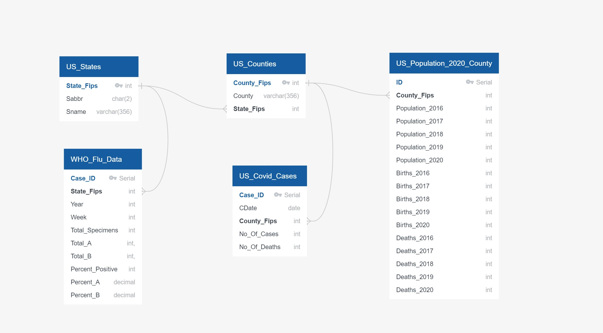

#### Project 2 - **Extract Transform Load**

<table><tr><td align="center"></tr></td></table>

## Project Description 
In 2020-2021, the most important global issue has been the COVID-19 pandemic. Health professionals and researchers around the world have been working hard to make available, the data related to cases, testing, and mortality. We are utilizing publically available Covid 19 data for our ETL project. 

**Brief introduction to ETL** 

We are living in a world of data. The volume of data that is being generated and collected continues to increase at an exponential rate.
As the amount of data grows, the importance of making use of that data grows as well. This data is immensely valuable for analytics, data science, and machine learning, not only to present valuable information and noticeable trends but also to derive business insights and predictions.
The data that is being captured and stored cannot be used in its raw form. Processing the raw, messy data into clean, consistent and reliable data is a critical step before it can be used.

ETL, which stands for Extract, Transform, and Load, is the process to
* Extract data from various sources 
* Transform the data into a clean, usable format
* Load the data into target database systems that end-users can access and use for further analysis, to make business decisions and, to solve problems.

**How ETL works** : Lets understand each step of the ETL process and how it relates to our project

## Extract : 
Raw data is extracted from various data sources, which can be structured or non structured. These sources can include but are not limited to:

* APIs, JSON, CSV, XML files
* RDBMS(MS SQl Server, MySql etc.) or NoSQL servers (MongoDB etc.)
* CRM (Salesforce Sales Cloud, Quickbase etc.) and ERP systems(Katana, Oracle NetSuite etc)
* Web pages

## How we 'Extract'ed:
**Data Sources :**
* Census Data : https://www2.census.gov/programs-surveys/popest/datasets/2010-2020/counties/totals/
    * Downloaded 2102 Census Data in csv format
* Covid 19 Data  : https://github.com/nytimes/covid-19-data
    * New York Times has collected a large amount of COVID-19 data for the United States, and they have made this data freely available in a Github repostory. We dowloaded their Covid Data in csv format.    
* Flu data for Comparision: WHO WEBSITE LINK GOES HERE
    * Dowloaded Influenza Data in csv format

## Transform : 
The second step consists of transforming the raw data that has been extracted from the above-mentioned sources into a format that can be used by different applications.
This can be compared to a staging area where the data gets cleansed, mapped, and transformed, often to a specific schema, so it meets operational requirements. 

## How we 'Transform'ed:
* After studying the raw data and identifying the columns from each table, created an Entity Relationship Diagram (ERD) to view a snap shot before rearranging data into required schema  

    * <table><tr><td align="center"></tr></td></table>
* Filtering, handling null values, removing duplicates, validating, and normalizing the data.
* Creating primary and foreign key relationships, applying referential integrity if using relational databases, and redistributing clean data into the right tables.
    * All datasets that we sourced had county and/or state. We create seperate tables for each that act as primary tables and all other tables can reference them with a foreign key.

* Formatting the data into tables or joined tables to match the schema of the target data systems.
* Performing calculations or summarizations on the raw data. This can include changing row and column headers for consistency, converting dates,  or other units of measurement, editing text strings, etc.
* Conducting tests/audits to ensure data quality and compliance.
* Encrypting, or protecting data governed by industry standards or government regulations.

## Load : 
This last step involves moving the transformed data to a target data warehouse. Initially, the final data is loaded once, and thereafter periodic loading of data happens to keep the database up to date. Most of the time the ETL process is automated and batch-driven. Typically, ETL is scheduled to trigger during off-hours when traffic on the source systems and the destination systems is at its lowest.

-----------------------------------------------------------------------------------------------------
**Examples of How our data can be used**:
 
Analysis -- Reports (showing covid cases vs flu) 
 
daily covid cases with new cases
 
Visualizations -- US Map displaying covid active cases 

